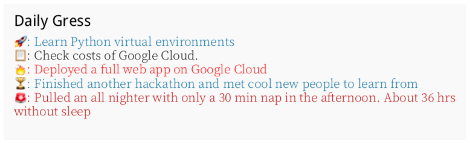
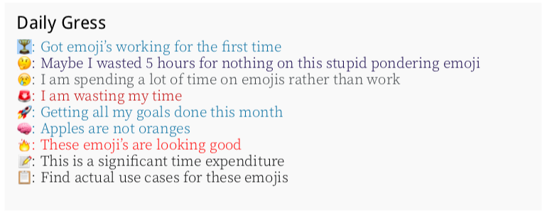
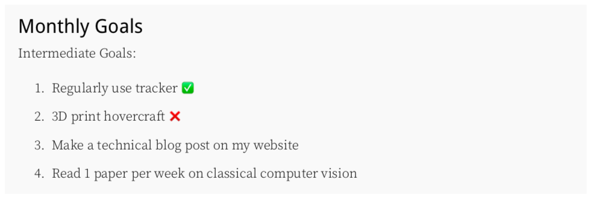
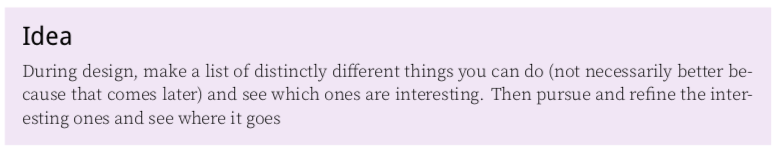
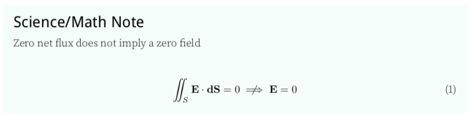

# `gress` - LaTeX Class for Daily Progress Tracker and Technical Notes

`gress` short for "progress" (or "regress" 😢) is a LateX class file used for a
progress tracker and technical notes. Note that it currently only works with
`pdflatex`.

Currently I use it to document and reflect on the different events, thoughts,
and ideas that I encounter during my everyday life as an engineering student.
I'm a bit biased, but I used `gress` recently when reflecting on a 24 hour
hackathon and I thought it was a good way to fully capture my ideas and
experience to look back on later. See `examples` to check out my full reflection
(taken verbatim from own progress tracker) as a comprehensive example of how
`gress` works!

Now, you may be thinking that LaTeX is overkill for a personal journal/progress
tracker and you'd probably be right. But for all the extra complexity that LaTeX
brings, you also get the ability to have beautifully typeset entries with neat
PDF links. The real killer feature though is the ability to use LaTeX's many
packages to input mathematical formulas and symbols for when you want to get
technical.

To be honest it's still pretty overkill and most of the features aren't needed.
But if you work in a science/math heavy field and want to take detailed notes,
I think this is a solid way to go. Oh and I also added some emoji's to spice
things up!

Currently, this is just something that I use for myself and is customized to my
needs/preferences. However, if you have any features that you would like me to
add, just let me know! There are currently no plans to make this into package
for CTAN.

I've also only tested this on macOS High Sierra, so please let me know if you
have some free time to help test different systems.

## Installations
1. Find out where `texmf` is on your computer

```bash
kpsewhich -var-value=TEXMFHOME
```

For me on macOS, this gives me `/Users/Seangottarun/Library/texmf`. For Windows,
you might get something like `C:/Users/Seangottarun/texmf` or `~/texmf/` on UNIX
or Linux.

2. Then `git clone` the latest copy of `gress` from my GitHub repo and move the
file to wherever `texmf` is located for you and store it inside a folder called
`latex` (you might need to make this if you don't already have it)

```bash
git clone https://github.com/Seangottarun/gress.git
# move gress to texmf
# for example, I would run
mv gress /Users/Seangottarun/Library/texmf/tex/latex # your mv command might be different
```

3. Then `git clone` [my fork](https://github.com/Seangottarun/coloremoji.sty.git)
of the `coloremoji` package and place it at `/Users/Seangottarun/Library/texmf/tex/latex/` (for macOS users). Big thanks to [@alecjacobson](https://github.com/alecjacobson) for writing the original [`coloremoji`](https://github.com/alecjacobson/coloremoji.sty) LaTeX package that I used for `gress`!

```bash
git clone https://github.com/Seangottarun/coloremoji.sty.git
# move the coloremoji to same spot for texmf that you put gress before
mv coloremoji /Users/Seangottarun/Library/texmf/tex/latex/
```

4. Check that everything works by making sure `kpsewhich` returns the right path

```bash
kpsewhich gress.cls
kpsewhich coloremoji.sty
```

## Key Features
1. Track your daily `gress` with cool emojis. My personal favourites are
`\bigbrain{}` and `\spicy{}`, but `\issue{}`, `\todo{}`, and `\note{}` are
very practical.

```
\begin{gress}
  \moonshot{Learn Python virtual environments}
  \todo{Check costs of Google Cloud.}
  \spicy{Deployed a full web app on Google Cloud}
  \win{Finished another hackathon and met cool new people to learn from}
  \issue{Pulled an all nighter with only a 30 min nap in the afternoon. About 36 hrs without sleep}
\end{gress}
```



Here's a quick summary of all the different options that I have so far for
describing your `gress`. I copied this from the first time I got them all
working, so ya it's pretty random.

```
\begin{gress}
  \win{Got emoji's working for the first time}
  \thought{Maybe I wasted 5 hours for nothing on this stupid pondering emoji}
  \sad{I am spending a lot of time on emojis rather than work}
  \issue{I am wasting my time}
  \moonshot{Getting all my goals done this month}
  \bigbrain{Apples are not oranges}
  \spicy{These emoji's are looking good}
  \note{This is a significant time expenditure}
  \todo{Find actual use cases for these emojis}
\end{gress}
```



2. Create `goals` environments to track long term objective. You can also record
your progress with a quick emoji 👍.

```
\begin{goals}{Monthly Goals}
Intermediate Goals:
\begin{enumerate}
  \item Regularly use tracker ✅
  \item Make a technical blog post on my website
  \item 3D print hovercraft ❌
  \item Read 1 paper per week on classical computer vision
\end{enumerate}
\end{goals}
```




3. Create specialized environments to record notes and observations on
specific topics

```
\begin{idea}
  During design, make a list of distinctly different things you can do (not necessarily better because that comes later) and see which ones are interesting. Then pursue and refine the interesting ones and see where it goes
\end{idea}
```



```
\begin{scimath}
Zero net flux does not imply a zero field

\begin{align}
    \iint_S \vect{E} \cdot \vect{dS} = 0 \centernot\implies \vect{E} = 0
\end{align}

\end{scimath}
```




## Upcoming Features
- [X] Allow weekly goals and daily goals (not just monthly)
- [ ] Add `classy` option for a more professional style progress tracker without emoji's
- [ ] Add more color options
- [ ] Dark and Light mode
- [ ] Add more title page image options
- [ ] Add documentation
- [ ] Fix missing logo on 1st page
